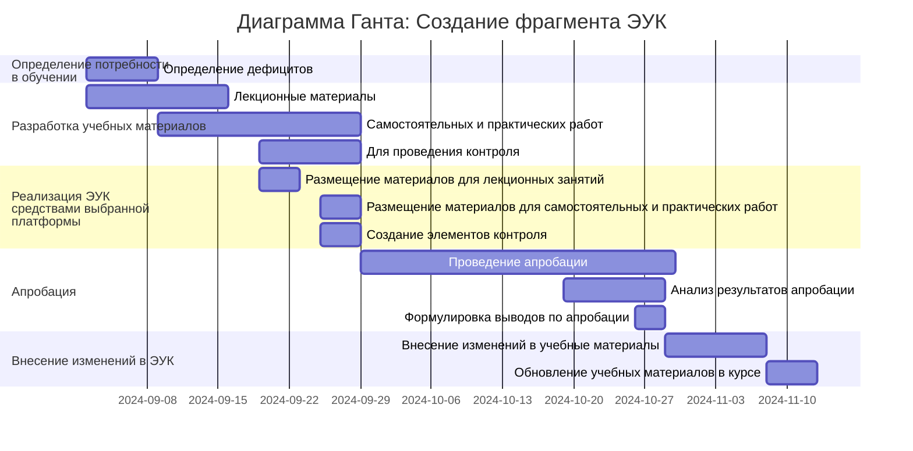

## Инвариантная самостоятельная работа 1.2

### Создание диаграммы Ганта для организации проектной деятельности по разработке компонента образовательной среды для образовательного учреждения и анализ потенциальных рисков

#### Потенциальные риски

| Этап                                          | Риск                                                                  | Потенциальное решение                                                                                                                                                                             |
| --------------------------------------------- | --------------------------------------------------------------------- | ------------------------------------------------------------------------------------------------------------------------------------------------------------------------------------------------- |
| Определение дефицитов                         | Низкие дефициты в области проведения обучения                         | Построение курса с учётом наличия у обучающихся знаний в предметной области. Акцентирование на изучении новых для обучающихся тем, а также на повторении и закреплении имеющихся знаний и навыков |
|                                               | Высокие дефициты в области проведения обучения                        | Построение курса с учётом недостаточных знаний у обучающихся. Акцентирование на ключевых знаниях и навыках относящихся к предметной области.                                                      |
| Разработка учебных материалов                 | Недостаточная разработанность предметной области проведения обучения  | Разработка предметной области в процессе работы над учебными материалами                                                                                                                          |
| Реализация ЭУК средствами выбранной платформы | Отсутствие втроенных элементов контроля                               | Проведение контроля внешними средствами, например с помощью Яндекс Форм                                                                                                                           |
| Апробация и внесение изменений в ЭУК          | Отсутствие отдельного времени на апробацию и внесение изменений в ЭУК | Проведение апробации и внесение изменений в ЭУК по ходу проведения обучения                                                                                                                       |
