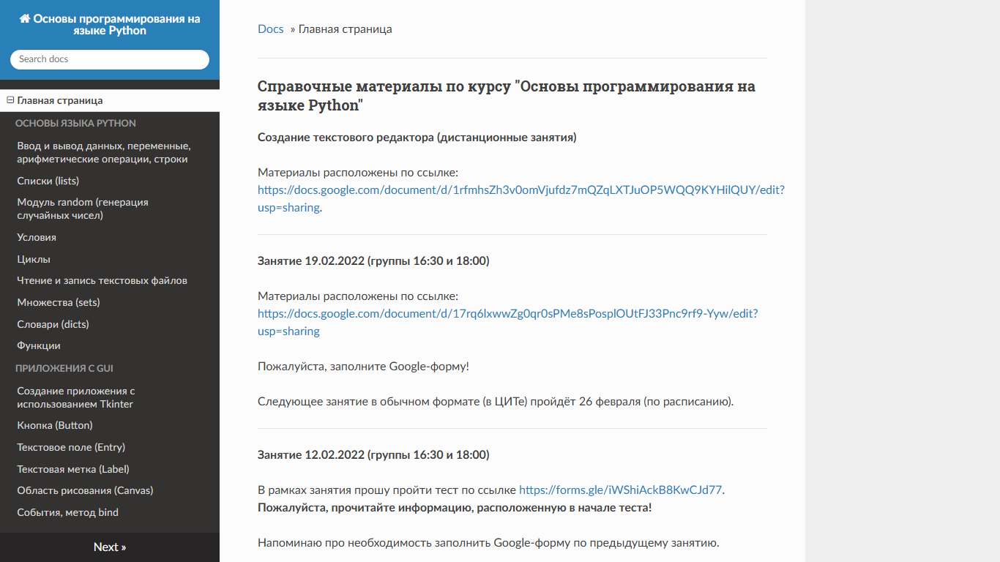

# System Usability Scale

### Тестируемый компонент образовательной среды

В ходе работы проведено тестирование электронного образовательного ресурса.

Ссылка на ресурс: [Основы программирования на языке Python](https://balrundev.ru/python-basics/)

## Результаты юзабилити-тестирования с использованием шкалы System Usability Scale

### Респондент №1

| Вопрос                                                                                       | Результат |
|:-------------------------------------------------------------------------------------------- |:---------:|
| Я готов часто пользоваться этим приложением.                                                 | 4         |
| Приложение оказалось необоснованно сложным.                                                  | 2         |
| Приложением было просто пользоваться.                                                        | 4         |
| Мне понадобится техническая поддержка чтобы пользоваться этим приложением.                   | 1         |
| Связь разных функций приложения приложения хорошо продумана и логично отработана.            | 3         |
| Приложение нельзя назвать целостным продуктом.                                               | 2         |
| Я думаю, большинство людей смогут очень быстро изучить приложение и начать его использовать. | 5         |
| Работа с приложением создаёт тягостное ощущение.                                             | 1         |
| Я уверенно пользовался этим приложением.                                                     | 5         |
| Мне нужно изучить много информации, прежде чем начать работать с этим приложением.           | 2         |

### Респондент №2

| Вопрос                                                                                       | Результат |
|:-------------------------------------------------------------------------------------------- |:---------:|
| Я готов часто пользоваться этим приложением.                                                 | 3         |
| Приложение оказалось необоснованно сложным.                                                  | 2         |
| Приложением было просто пользоваться.                                                        | 4         |
| Мне понадобится техническая поддержка чтобы пользоваться этим приложением.                   | 2         |
| Связь разных функций приложения приложения хорошо продумана и логично отработана.            | 3         |
| Приложение нельзя назвать целостным продуктом.                                               | 2         |
| Я думаю, большинство людей смогут очень быстро изучить приложение и начать его использовать. | 4         |
| Работа с приложением создаёт тягостное ощущение.                                             | 1         |
| Я уверенно пользовался этим приложением.                                                     | 4         |
| Мне нужно изучить много информации, прежде чем начать работать с этим приложением.           | 1         |

### Респондент №3

| Вопрос                                                                                       | Результат |
|:-------------------------------------------------------------------------------------------- |:---------:|
| Я готов часто пользоваться этим приложением.                                                 | 5         |
| Приложение оказалось необоснованно сложным.                                                  | 1         |
| Приложением было просто пользоваться.                                                        | 5         |
| Мне понадобится техническая поддержка чтобы пользоваться этим приложением.                   | 1         |
| Связь разных функций приложения приложения хорошо продумана и логично отработана.            | 4         |
| Приложение нельзя назвать целостным продуктом.                                               | 2         |
| Я думаю, большинство людей смогут очень быстро изучить приложение и начать его использовать. | 5         |
| Работа с приложением создаёт тягостное ощущение.                                             | 1         |
| Я уверенно пользовался этим приложением.                                                     | 5         |
| Мне нужно изучить много информации, прежде чем начать работать с этим приложением.           | 1         |

## Выводы:

Большинство респондентов отметили, что приложением было просто пользоваться. По их мнению, большинство людей смогут очень быстро изучить и начать использовать приложение в своей деятельности.
