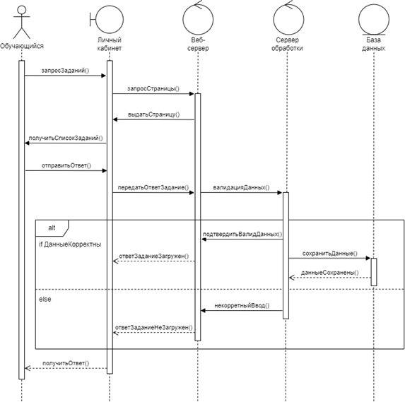
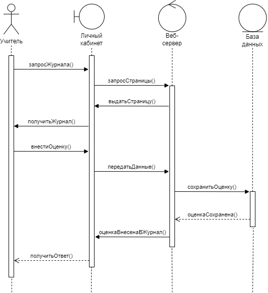
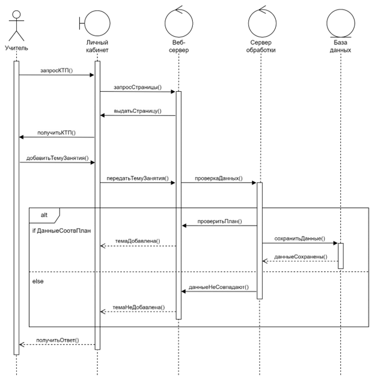

# Анализ модуля образовательной среды

Проведена аналитика возможной функциональности электронного образовательного ресурса, для которого разработаны макеты в рамках ИСР 2.1.

Диаграмма последовательности является одной из разновидности диаграмм взаимодействия и предназначена для моделирования взаимодействия объектов системы во времени, а также обмена сообщениями между ними.

В ходе работы построены диаграммы последовательности для следующих прецедентов:

- отправка обучающимся ответа на задание;

- внесение оценок в электронный журнал;

- добавление темы занятия в календарно-тематическое планирование (КТП).

### Отправка ответа на задание

### Внесение оценок в журнал

### Добавление занятия в календарно-тематическое планирование

