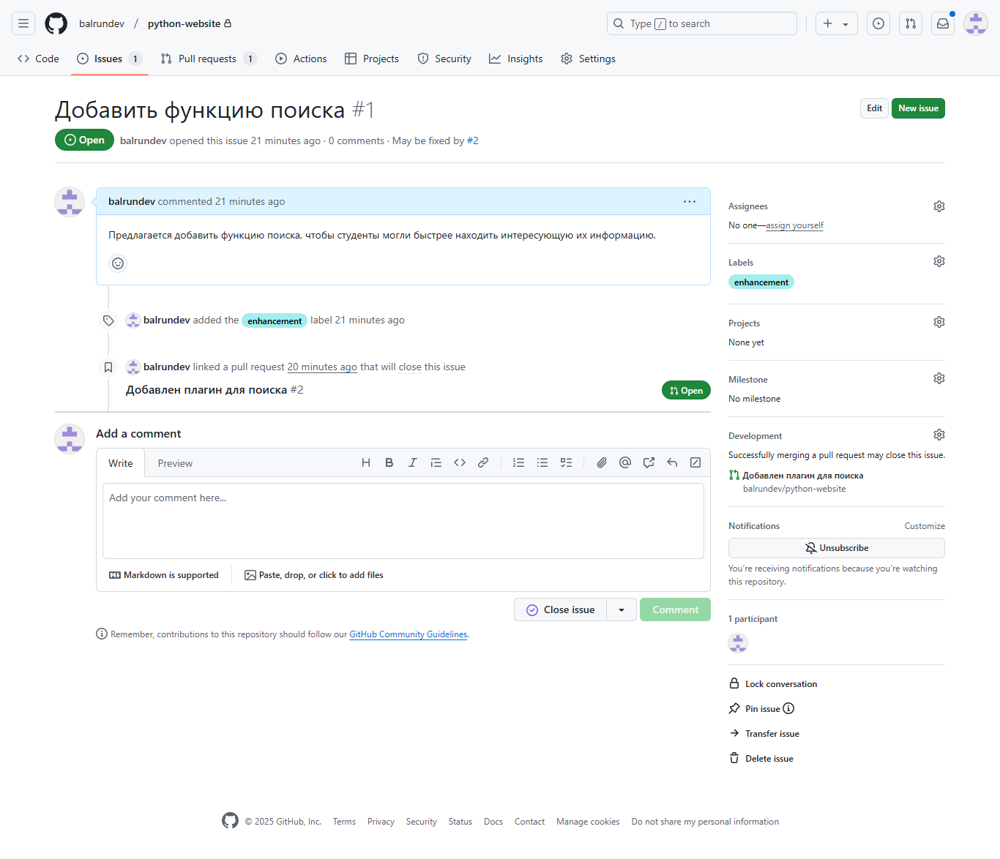
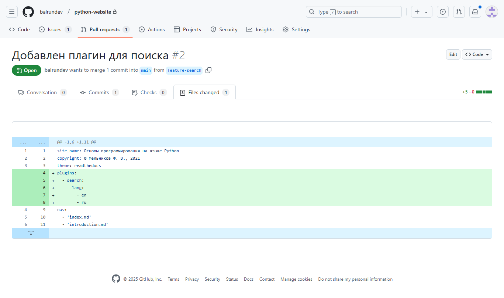
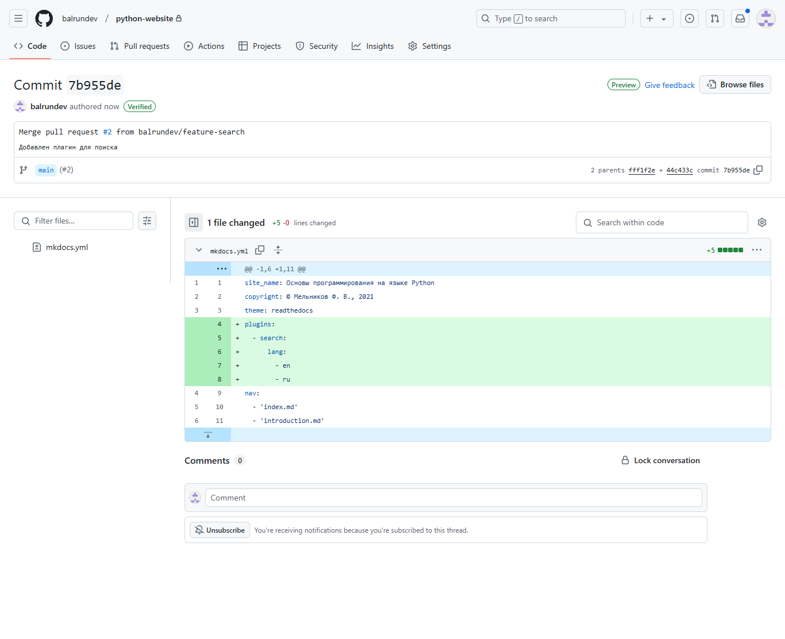
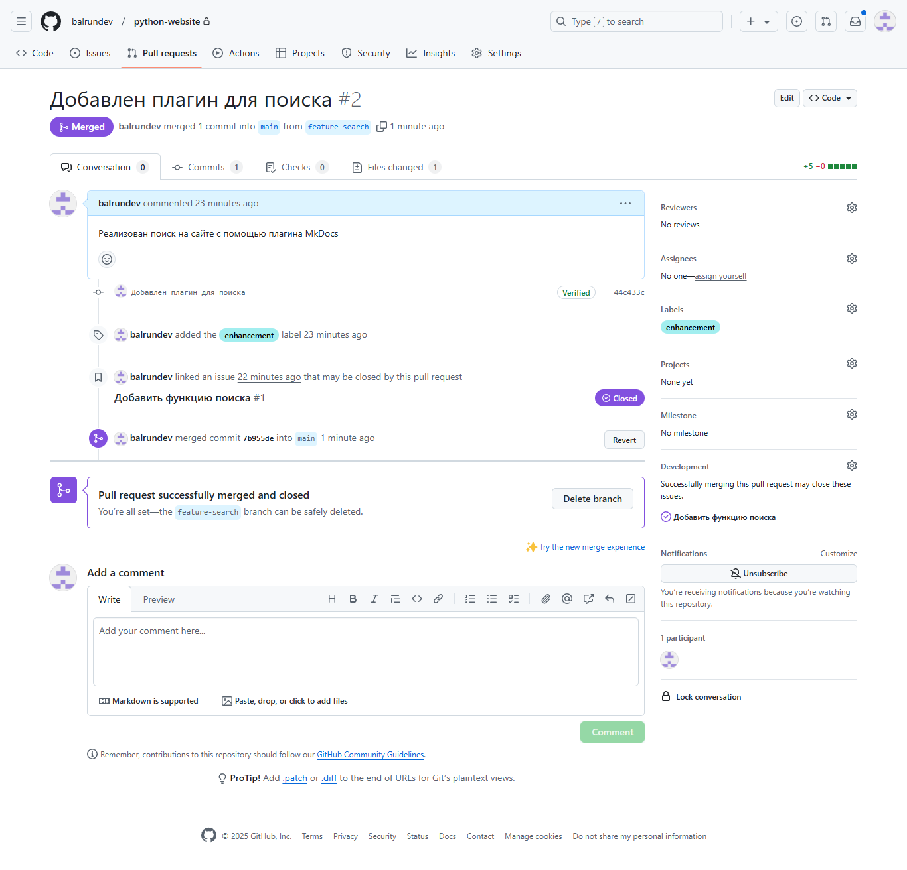

# Стратегии ветвления (Branching Strategies)

## Описание стратегий

### Git Flow

Универсальная стратегия ветвления. В репозитории есть ветки, каждая из клторых имеет назначение:

- main/master – текущая production-версия;

- develop – активная ветка разработки;

- feature – ветки для разработки новой функциональности;

- release – релизная версия;

- hotfix – правки, исправление багов и другие небольшие изменения в production или релизной версии.

После разработки новой функции изменения переносятся из ветки feature в ветку develop. Релизная ветка release базируется на develop. При необходимости в release могут исправляться баги, изменения вносятся через ветку hotfix. После релиза выполняется слияние release в main/master, при этом с помощью метки (tag) присвается номер версии.

### GitHub Flow

Представляет собой упрощение модели Git Flow. При разработке не используются ветки release. Активная ветка разработки – main/master, из неё в любой момент может быть создана production-версия. Разработка новых функций и исправление багов производится в feature-ветках, которые используются постоянно (не создаётся отдельная ветка для каждой новой функции). Для обозначения production-версий, как правило, используются метки (tags).

### GitLab Flow

Модель, которая объединяет свойства Git Flow и GitHub Flow. По сравнению с GitHub Flow, в модели используются отдельные ветки для разработки перед выпуском production-версии. Например, это могут быть ветки pre-production и production. Модель позволяет управлять разработкой нескольких версий одновременнл.

### Trunk Based Development

В модели используется только одна общая ветка разработки – trunk. Изменения могут вноситься как прямо в trunk, так и через ветки feature, которые рекомендуется сливать с trunk как можно чаще. При этом в feature необязательно разрабатывать новую функцию полностью. При выпуске релиза создаётся ветка release, в клторую потом не вносятся изменения.

В модели минимизировано применение веток, в которых ведётся продолжительная разработка. Это упрощает выполнение операций слияния, особенно если функция предполагает большой объём изменений.

## Выбор стратегии ветвления

Для добавления новой функции в веб-базированном ЭОР была выбрана стратегия GitHub Flow по следующим причинам:

- простота модели ветвления;

- короткий цикл разработки новой функциональности;

- реализация ЭОР не предполагает определённых релизов;

- модель подходит для асинхронной работы в небольших командах.

## Запрос на добавление функциональности

Создание запроса производится путём создания Issue в репозитории на платформе GitHub.

Необходимо точно описать желаемую функцию (или описать поведение продукта, если Issue создаётся для исправления бага).

Для добавления функции создаётся новая ветка или создаётся pull request (отображается в Development на странице Issue).

## Планирование работ по добавлению функциональности

| Описание этапа                                                                                                                                    | Продолжительность |
| ------------------------------------------------------------------------------------------------------------------------------------------------- | ----------------- |
| Аналитика, описание и уточнение требований к новой функциональности                                                                               | 3-5 дней          |
| Анализ возможных способов реализации                                                                                                              | 2-3 дня           |
| Реализация функциональности                                                                                                                       | 3-5 дней          |
| Тестирование                                                                                                                                      | 1 день            |
| Публикация обновлённой версии: слияние изменений в production, сборка и публикация в соответствии с практиками CI/CD (производится автоматически) | 1 день            |

## Добавление функциональности

#### Создание запроса



#### Внесение правок и создание Pull request

Правки внесены в ветку ```feature-search```. Заведён Pull request.


Изменения приведены на скриншоте ниже.



После внесения правок Pull request прилинкован к Issue.

После проверки изменений выполнено слияние `feature-search` и `main`, т.е. изменения перенесены в основную ветку.



После слияния статус Pull request меняется на **Merged**.



После обработки Issue переводится в статус **Closed**. В поле **Fixed By** отображается ссылка на рабочий элемент, с помощью которого Issue закрыто.


## Вывод

В ходе работы в продукт была добавлена новая функциональность. Изменения обработаны через Issue и Pull request. В соответствии с выбранной моделью ветвления GitHub Flow функция была добавлена в ветке `feature-search`. После проверки изменений выполнено слияние с `main`.


