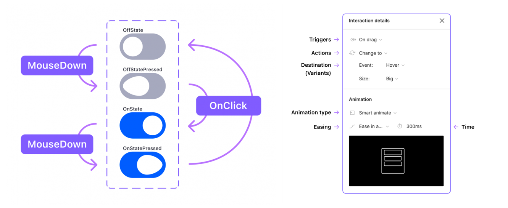

## Вариативная самостоятельная работа 1.1

### Исследование функциональности инструмента для прототипирования интерфейсов Figma. Анализ расширений для веб-разработчика

### Возможности Figma

#### Создание интерактивных прототипов

Figma позволяет создать интерактивную версию сайта или приложения. Можно протестировать и настроить любую функцию: кнопки, всплывающие меню, анимированные и модальные окна.

#### Группы и фреймы

Как и в других инструментах дизайна, группы в Figma позволяют объединять несколько элементов вместе в один слой верхнего уровня.

Фреймы – основополагающий элемент проектов, который может выступать в качестве контейнера верхнего уровня и / или представлять области или компоненты вашего дизайна. Фреймы и возможность их вложения являются неотъемлемой частью создания динамических макетов в Figma.

#### Компоненты

Компоненты — это повторяющиеся UI элементы в проектах. Вы можете создавать компоненты из кнопок, иконок, полей, меню, заголовков, форм и блоков.

Компоненты в Figma можно делать основными (Master components) и зависимыми (Instances). Изменения, вносимые в основной компонент, будут применятся к зависимому.

#### Векторные сетки

Эта функция позволяет создавать сложные векторные формы. Кроме того, векторные сетки облегчают работу с HTML: можно скопировать SVG код из внешнего источника и вставить его как векторный слой прямо в редактор или сохранить векторный объект из Figma как SVG код.

#### Адаптивная вёрстка с Auto Layout

Auto Layout позволяет автоматически изменять размеры элементов, растягивать компоненты. 

#### Управление версиями

Figma автоматически сохраняет изменения и позволяет отслеживать историю версий. Версиям можно присваивать названия, восстанавливать, дублировать.
В бесплатной версии видны изменения за последние 30 дней. В платной сохраняется история всех изменений с момента создания проекта.

#### Совместная работа

В Figma участники проекта могут одновременно комментировать, задавать вопросы и править макеты.

#### Панель Code

Для верстальщиков и программистов в Figma есть специальная панель Code, на которой можно скопировать CSS-стили для Web, а также код-разметки расположения и стилей для Android и iOS.

#### Поддержка плагинов

Плагины позволяют расширить функциональность Figma.

### Расширения Figma для преобразования макета в HTML-код

Инструменты автоматической генерации кода позволяют сократит время на разработку пользовательской части, но приводят к избыточности кода.

Ограничения:

* поддерживаются не все элементы типов (например, не поддерживаются iframe, псевдоэлементы);
* не все CSS-свойства полностью поддерживаются;
* поддерживаются не все типы media (не поддерживаются видео, анимированные GIF и др.);
* все шрифты должны быть загружены в Figma перед генерацией кода.

#### Figma to HTML

https://www.figma.com/community/plugin/851183094275736358/Figma-to-HTML

Поддерживает большое количество элементов.

#### Figma to HTML, CSS, React & more!

https://www.figma.com/community/plugin/747985167520967365/Figma-to-HTML%2C-CSS%2C-React-%26-more!

#### HtmlGenerator

https://www.figma.com/community/plugin/753195897635985866/HtmlGenerator

Поддерживает большое количество элементов.

#### Structure

https://www.figma.com/community/plugin/760966234320559456/Structure

Позволяет генерировать код HTML и SASS. Для уменьшения избыточности генерируемого кода авторы расширения Structure добавили возможности объединения блоков м удаления элемента из кода. 

### Источники:

Figma: обзор программы для веб-дизайна [Электронный ресурс] // SendPulse Blog. URL: https://sendpulse.com/ru/blog/figma (дата обращения: 15.09.2024)

Подробный разбор интерактивных компонентов (Interactive Components) Figma [Электронный ресурс] // UXPUB. URL: https://ux.pub/interactive-components-figma/ (дата обращения: 15.09.2024)

Как работают группы и фреймы в Figma [Электронный ресурс] // UXPUB. URL: https://ux.pub/kak-rabotayut-gruppy-i-frejmy-v-figma/ (дата обращения: 15.09.2024)
