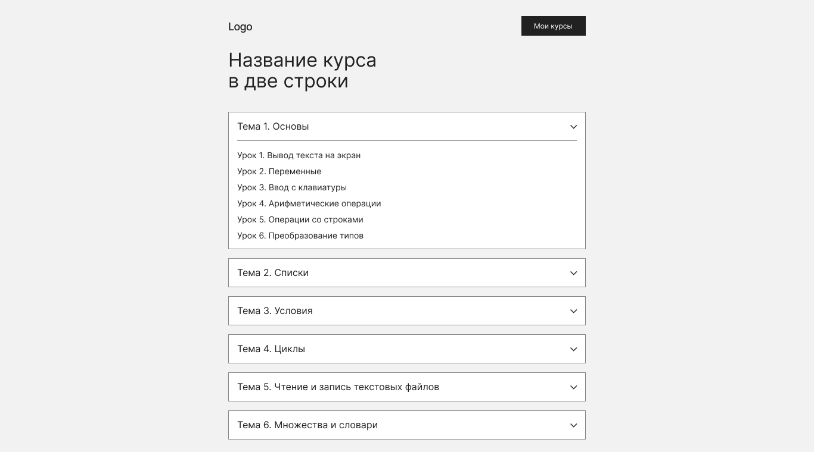
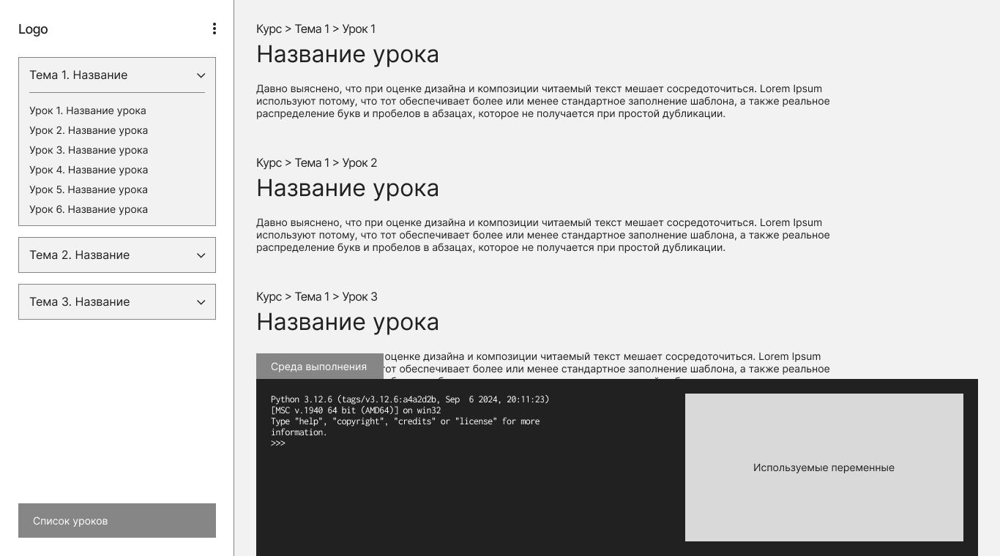
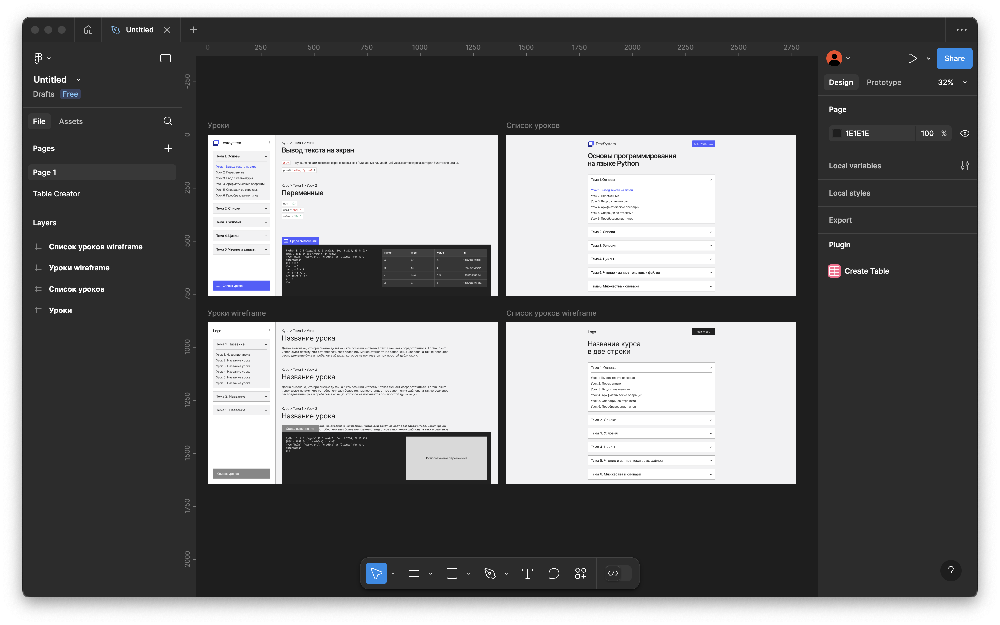

# Создание макета электронного образовательного ресурса

**Продукт:** электронный образовательный ресурс «Основы программирования на языке Python» с автоматизированной проверкой заданий.

### Страница курса

### Страница уроков по теме

### Проектирование интерфейса

Макеты выполнены в сервисе прототипирования интерфейсов **Figma**.

